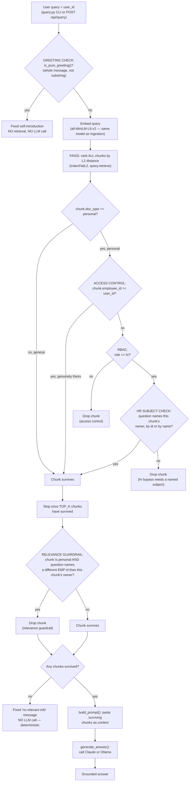

# Architecture

This document traces each piece of the pipeline to the exact code that
implements it: chunking, embedding, FAISS storage and search, where the
LLM is actually called, the three distinct security layers
(authentication, authorization, and a relevance guardrail) that are
often confused with each other but do genuinely different jobs here,
and the eval harness (`evals/`) that measures all of the above against
a golden dataset instead of trusting eyeballed examples.

## Query-time flow

Before any of this, the very first check is a plain string match — see
§9 below. Everything from `EMB` onward happens inside
`query.retrieve()`, in this exact order — access control is resolved
chunk-by-chunk *before* the top-`k` cutoff is applied, and the
relevance guardrail runs on the survivors *after* it, which is why the
diagram has two separate filtering stages rather than one:



The `NAMES_SUBJECT` diamond is what fixed the HR first-person bypass:
`HR001` asking a bare "what is my name?" now gets dropped there (no id,
no name in the query), instead of falling through to whichever
personal chunk happened to be closest. Note what's still *not* covered
anywhere in this diagram: the `OWNS` diamond's "yes" branch — a chunk
that's genuinely the requester's own — always survives unconditionally,
regardless of who the question names. If the requester asks about a
*different* name than their own (not an id — the `RELEVANCE GUARDRAIL`
diamond only matches `EMP\d+`), their own real data can still surface
under someone else's name. That's the remaining
`known_limitation_name_bypass` gap in §7/§8 — a real, tracked, and
currently unfixed hole, not a missing box.

## 1. Chunking — where and how

**Where:** `ingest.py`, `chunk_text()` (line 35) and `build_chunks()`
(line 87). Runs once, offline, when you execute `python ingest.py` —
never at query time.

**How:** each `.md` file in `hr_docs/` is loaded whole (`load_documents()`,
line 27), then sliced into overlapping fixed-size windows:

```python
CHUNK_SIZE = 500      # config.py
CHUNK_OVERLAP = 50
```

`chunk_text()` slides forward by `CHUNK_SIZE - CHUNK_OVERLAP` (450)
characters per step, so the last 50 characters of one chunk reappear at
the start of the next — this is what stops a sentence sitting on a
chunk boundary from being torn in half with no chunk containing it whole.

`build_chunks()` then attaches metadata to every chunk before anything
gets embedded: `source_file`, `chunk_id`, `doc_type` (`"general"` /
`"personal"`, from `config.PERSONAL_DOCS`), and `employee_id`. This
metadata is what the access-control layer (§6) and the relevance
guardrail (§7) key off later — it rides along with the chunk all the
way through embedding and retrieval.

## 2. Embedding — where and how

**Where:** `ingest.py`, `embed_chunks()` (line 130) at ingest time;
`query.py`'s `retrieve()` (line 61, first line of the function body) at
query time — **the same model is used in both places**, which is
required: embedding the query with a different model would land it in
a differently-shaped vector space, making distance comparisons
meaningless.

**How:** `all-MiniLM-L6-v2` via `sentence-transformers`
(`config.EMBEDDING_MODEL_NAME`). It's a 3-stage local pipeline (no API
call, no network):

1. **Transformer** (a distilled BERT, 6 layers) — text in, one vector
   per token out.
2. **Pooling** (mean over all token vectors) — collapses that into a
   single fixed-length vector regardless of input length.
3. **Normalize** — rescales it to unit length.

The output is always a **384-dimensional** vector (`embed_chunks()`
casts it to `float32`, which FAISS requires). At ingest time this runs
once over all 34 chunks in a single batched `model.encode()` call; at
query time it runs once over the single incoming question.

## 3. Storing embeddings into FAISS

**Where:** `ingest.py`, `build_faiss_index()` (line 157) and
`save_index_and_metadata()` (line 179).

**How:** `build_faiss_index()` creates a flat, uncompressed index —
`faiss.IndexFlatL2(384)` — and adds every chunk's 384-dim vector to it
via `index.add(embeddings)`, in order. FAISS assigns each vector a
position (0, 1, 2, ...) matching that insertion order, but **stores
only the numbers** — never the chunk's text or metadata.

That's why `save_index_and_metadata()` writes **two files that only
work together**:

- `faiss_index.bin` — the vectors (`faiss.write_index`).
- `chunks_metadata.json` — a plain list where position *i* holds the
  text + metadata for whichever chunk's vector is at position *i* in
  the FAISS index.

`query.py`'s `load_index_and_metadata()` (line 25) reads both back at
query time — a FAISS "position 7 is closest" result is meaningless
without this list to turn position 7 back into actual text.

## 4. How the FAISS index actually operates

The index type in use is `IndexFlatL2` — the simplest FAISS offers:
no compression, no approximation. A search computes the literal
Euclidean (L2) distance from the query vector to **every** stored
vector, then returns the *k* closest — brute force, but entirely fine
at 34 vectors.

In `retrieve()` (`query.py`, line 61), the search deliberately asks for
**all** chunks ranked (`index.search(query_vector, index.ntotal)`), not
just the top `k`:

```python
distances, positions = index.search(query_vector, total_chunks)
```

Access control (§6) and the relevance guardrail (§7) are then applied
to that *full* ranked list, and only afterward are the top
`config.TOP_K` (3) survivors taken. Filtering before truncating matters:
if you filtered *after* taking just the top 3, a blocked chunk could
occupy one of those 3 slots and silently crowd out a chunk that should
have been returned instead.

## 5. Where the LLM is actually called

**Where:** `query.py` — `call_anthropic()` (line 238), `call_ollama()`
(line 262), and the dispatcher `generate_answer()` (line 274) that
picks between them based on `config.LLM_PROVIDER` (or a per-request
override from `server.py`).

**Call sites:**
- CLI: `query.py`'s `main()` (line 291).
- Web UI: `server.py`'s `run_query()` (line 99), the `POST /api/query`
  handler.

Both call sites follow the same three steps: `retrieve()` →
`apply_relevance_guardrail()` → (if anything survives) `build_prompt()`
→ `generate_answer()`. The LLM only ever sees chunk text that has
already passed both the access-control filter and the relevance
guardrail — it never receives, and therefore can never leak, a chunk
that was filtered out upstream.

`build_prompt()` (`query.py`, line 206) is what makes the generation
*retrieval-augmented* rather than the model just answering from its own
training: it pastes the surviving chunk text into the prompt and
explicitly instructs the model to answer only from that context and say
so if it can't.

## 6. Authentication and Authorization

These are two different things, and it's worth being precise since only
one of them is real here.

### Authentication (AuthN) — proving who you are

**Not implemented.** `config.CURRENT_USER_ID` (CLI) and the API's
`user_id` request field (web UI) are simply asserted, not verified —
there is no login, no password check, no session, no signed token. A
real system would authenticate a user first (e.g. verifying a signed
JWT) and only then trust the identity it names.

### Authorization (AuthZ) — what that identity can access

**Implemented**, in three layers, all in `retrieve()` (`query.py`, line
61):

1. **Ownership-based access control** — a chunk tagged `"personal"` is
   excluded unless `chunk["employee_id"] == current_user_id`. This is
   attribute comparison (is the requester the owner?), not role-based
   access. If it belongs to the requester, it survives unconditionally
   — nothing later in this section re-examines that decision.
2. **RBAC (role-based) extension** — `config.USERS` maps each user id to
   a role (`"employee"` or `"hr"`). An `"employee"` role is fully bound
   by rule 1; an `"hr"` role gets a *conditional* bypass, checked next.
3. **HR subject check** (`_query_names_employee()`, query.py line 46)
   — the hr bypass only admits a chunk belonging to someone else when
   the query actually names that specific person, by id (`EMP\d+`) or
   by name (`config.EMPLOYEE_NAMES`). Without this, an `hr`-role request
   for a vague "what is my name?" would return whichever employee's
   chunk happened to be closest, mislabeled as the requester's own —
   a real bug, found live and fixed here, not in the guardrail (§7),
   because it's about which chunks are *eligible at all*, not about
   re-filtering chunks that already passed access control:

   ```python
   belongs_to_someone_else = (
       chunk["doc_type"] == "personal" and chunk["employee_id"] != current_user_id
   )
   if belongs_to_someone_else:
       if current_role != "hr":
           continue  # no bypass available -- blocked by ownership
       if not _query_names_employee(query, chunk["employee_id"]):
           continue  # hr bypass requires naming whose record this is
   ```

**The one part of this that *is* handled the way a real system would:**
in `server.py`'s `run_query()` (line 99), the client's request can only
supply `user_id` — never `role`. The role is looked up server-side from
`config.USERS[user_id]` on every request. A client cannot put
`"role": "hr"` in its request body and grant itself HR access; the
server-side lookup is the only source of truth for role, exactly as a
real backend must never trust a client-asserted permission level.

## 7. How this is secured with Guardrails

A **guardrail**, in this project, means something narrower and
different from authorization: authorization decides *who may see a
chunk*; the guardrail decides *whether a chunk the requester is
otherwise allowed to see is actually relevant to what they asked*. A
chunk can pass authorization and still be the wrong answer.

**Where:** `query.py`, `apply_relevance_guardrail()` (line 168), called
from both `main()` and `server.py`'s `run_query()` right after
`retrieve()` and before `build_prompt()`/`generate_answer()`.

**Why it exists:** discovered via a real bug — a user logged in as
`EMP10453` asked *"can you share the EMP99999 CTC?"*. Access control
correctly allowed `EMP10453`'s own offer-letter chunks through (they're
his own document), but the LLM then misattributed his CTC figure to
`EMP99999` — a hallucinated attribution the access-control layer had no
way to prevent, since it isn't wrong about *who owns* the chunk.

**How it works:** if the question names a specific employee ID (regex
`\bEMP\d+\b`, `config.EMPLOYEE_ID_PATTERN`), any personal chunk whose
`employee_id` doesn't match one of the named IDs is dropped —
regardless of embedding distance, regardless of who's asking. If
nothing survives, the LLM is **never called**; a fixed message
(`NO_RELEVANT_CONTEXT_MESSAGE`) is returned deterministically instead.
This is what makes "no relevant match" a hard guarantee rather than
something left to the model's judgment.

**A design decision worth recording:** an embedding-distance cutoff
(reject any chunk above some fixed distance) was tried here first and
abandoned. At this corpus size with `all-MiniLM-L6-v2`, genuinely
relevant and genuinely irrelevant matches land in *overlapping* distance
ranges — a real answer to "What is my CTC?" scored a worse distance
than a genuinely irrelevant match for an unrelated question. No single
threshold could separate them without either missing real bugs or
blocking real answers, so the guardrail is intentionally narrow (an
exact employee-ID mismatch) rather than a blanket similarity cutoff.

## 8. The eval harness — how all of the above is actually verified

Everything in §1–§7 is measured by `evals/`, against a 21-case golden
dataset grounded in `hr_docs/`'s real content (`evals/dataset.py`,
`CASES`, line 84) — not by re-reading this document and trusting it.

**The harness reuses the real pipeline; it does not reimplement it.**
`evals/run_retrieval_eval.py`'s `run_case()` (line 100) calls the exact
`query.retrieve()` and `query.apply_relevance_guardrail()` from §4/§7,
and `evals/run_answer_eval.py`'s `run_case()` (line 104) additionally
calls the real `query.build_prompt()` and `query.generate_answer()`
from §5. If those functions change, the eval results change with them —
there's no separate "eval version" of the logic to drift out of sync.

**Two speeds, by design:**
- `run_retrieval_eval.py` and `sweep.py` never call an LLM — only
  §1–§4 and the access-control/guardrail parts of §6/§7 are exercised,
  so they're fast enough to run after every `config.py` change.
  `sweep.py`'s `build_temp_index()` (line 56) re-runs §1–§3 (chunking →
  embedding → `IndexFlatL2`) into a `tempfile.TemporaryDirectory()` for
  every `(CHUNK_SIZE, CHUNK_OVERLAP)` combination — `ingest.py`'s
  `build_chunks()`, `save_index_and_metadata()`, and `query.py`'s
  `load_index_and_metadata()` all take optional path/size overrides
  specifically so this works without ever touching the real
  `faiss_index.bin`.
- `run_answer_eval.py` calls §5's `generate_answer()` for real, so it's
  slow, costs real inference, and is run on demand rather than routinely.

**What it found that this document alone wouldn't have surfaced**
(full writeups in `evals/FINDINGS.md`):
- A genuine retrieval gap, confirmed and still open: the chunk
  containing the appraisal letter's revised-CTC figure never makes the
  top-3 results for a direct question about it — §1's fixed-size
  chunking split that document such that its header chunk outscores
  the chunk with the actual number. Invisible to `hit@k` (file-level —
  the file shows up via the header chunk), only visible via Stage 4's
  `expected_answer_contains` check. Investigated whether the same
  cause shreds a different table (`06_expense_travel_policy.md`'s
  per-diem grid) — it doesn't; that table is fully intact in one chunk.
- A genuine generation error: asked about "Senior Manager" per-diem, the
  model in §5 answered with the "Senior Associate/Manager" row's value
  instead — a real mix-up between two similarly-named table rows, not a
  retrieval or access-control problem (the table was retrieved intact).
- A real interaction between §4 and §7: raising `TOP_K` can let a stray
  general chunk survive alongside the guardrail's filtering, so
  `guardrail_triggered` reads `False` even though no personal data
  leaked — the deterministic block in §7 becomes less reliable at
  higher `TOP_K`, falling back to the LLM's own judgment instead.
- One `known_limitation` case, `known_limitation_name_bypass`, keeps
  the remaining §7 gap (the guardrail's `EMP\d+` regex never matches a
  name) measured on every run via `evals/test_regressions.py`'s pytest
  gate (`MIN_HIT_RATE`, line 53) — present, tracked, and explicitly
  excluded from the pass/fail gate rather than silently patched. A
  second, related case (the RBAC bypass plus a vague "what is my
  name?" with no name or ID at all — confirmed live: HR001 got back
  "Priya Ramanathan") was found the same way and has since been
  **fixed** in §6's `retrieve()` (a new `NAMES_SUBJECT` check, not the
  guardrail) and promoted to a real, enforced regression gate.
- Leaks are now split by severity (`leak_type`: `access_violation` vs.
  `wrong_subject`) rather than one flat count — see `evals/FINDINGS.md`.

## 9. Greeting short-circuit — where and how

**Where:** `query.py` — `GREETING_RESPONSE` (line 131),
`_GREETING_PHRASES` (line 143), `is_pure_greeting()` (line 149).
Called from both entry points *before* `retrieve()` ever runs: the
CLI's `main()` and `server.py`'s `run_query()` (line 112) — this is a
gate on top of the whole query-time flow in the diagram above, not a
step inside it.

**Why it exists:** a bare `"hi"` typed into the chat UI used to go
through the entire pipeline anyway — embedded, searched against FAISS,
handed whatever chunks happened to be least-far-away as "context," and
the LLM was left to improvise a reply to an input that isn't a
question at all. The result was a confusing, technical-sounding
non-answer: *"There's no question provided."* Nothing about retrieval
or access control was wrong here — every layer in §1–§7 did exactly
what it was supposed to on a nonsensical input. The gap was that
nothing in the pipeline had a concept of *"this message isn't asking
about anything."*

**How it works:** `is_pure_greeting()` normalizes the query (strip
whitespace, lowercase, strip trailing `!`/`.`/`?`) and checks it
against `_GREETING_PHRASES` — a small fixed set (`"hi"`, `"hello"`,
`"hey"`, `"good morning"`, ...) — as an **exact match on the entire
message, never a substring match**. This precision is deliberate and
tested: `"hi, how many casual leaves do I get?"` does **not** match —
it's a real question that happens to start with a greeting, and it
correctly still retrieves 3 chunks and answers normally. A bare
`"hi"`, `"hello"`, or `"Hello!"` (punctuation-insensitive) matches and
retrieves **zero** chunks.

**What happens on a match:** both call sites return
`GREETING_RESPONSE` — a fixed self-introduction naming what the
assistant can help with — immediately. No embedding, no FAISS search,
no LLM call at all happens for a greeting. This follows the exact same
principle as `NO_RELEVANT_CONTEXT_MESSAGE` in §7: a fixed, pre-written
response beats hoping an LLM improvises well on an edge case every
single time, and it's also strictly cheaper (skips retrieval, which
`NO_RELEVANT_CONTEXT_MESSAGE`'s path does not — that one still runs
retrieval and the guardrail first, only skipping the LLM call).

**Not yet covered by the eval harness (§8):** every case in
`evals/dataset.py` is built around retrieval/access-control scenarios;
none currently exercises `is_pure_greeting()` itself. A regression here
(e.g. an edit that turns the whole-message check into a substring
check, which would wrongly swallow real questions containing a
greeting) would not be caught automatically today.

## Summary: three layers, three different questions

| Layer | Question it answers | Implemented? | Covered by `evals/`? |
|---|---|---|---|
| Authentication | Is this really who they claim to be? | No — simulated only | N/A — nothing to measure |
| Authorization (ownership + RBAC) | Is this identity allowed to see this chunk? | Yes | Yes — leak count, every run |
| Relevance guardrail | Is this chunk actually about what was asked? | Yes (narrow, targeted) | Yes — `expect_guardrail` + 1 tracked `known_limitation` case |

All three are independent — a chunk can pass one and fail another (as
the original bug demonstrated: authorization said yes, relevance should
have said no).
